# BookInfo 微服务实验记录

> 实验目标：使用 Docker 和 Kubernetes 部署 BookInfo 微服务（YAML 部署和源码部署）

---

## 环境信息

| 项目 | 版本/信息 |
|------|---------|
| 操作系统 | Windows |
| Docker | 27.0.3 |
| kubectl | v1.29.2 |
| kind | 待安装 |

---

## 一、环境准备

### 1.1 安装 kind（Kubernetes IN Docker）

Docker Desktop 的 k8s 集群未启用，使用 kind 创建本地集群。

```powershell
# 下载 kind for Windows
curl.exe -Lo kind.exe https://kind.sigs.k8s.io/dl/v0.22.0/kind-windows-amd64
Move-Item kind.exe C:\Windows\kind.exe

# 验证安装
kind version
```

**执行结果：**
`kind v0.22.0 go1.20.13 windows/amd64`

---

### 1.2 创建 5 节点 kind 集群

集群配置：1 个 control-plane + 4 个 worker 节点

```yaml
# kind-config.yaml
kind: Cluster
apiVersion: kind.x-k8s.io/v1alpha4
nodes:
  - role: control-plane
  - role: worker
  - role: worker
  - role: worker
  - role: worker
```

```powershell
kind create cluster --name bookinfo-cluster --config kind-config.yaml
```

**执行结果：**
配置了代理 `$env:HTTP_PROXY="http://127.0.0.1:10809"; $env:HTTPS_PROXY="http://127.0.0.1:10809"` 并成功使用 `kind create cluster --config kind-config.yaml` 启动集群。

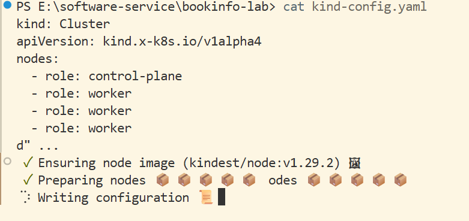


---

## 二、YAML 部署 BookInfo

### 2.1 创建命名空间

```powershell
kubectl create namespace bookinfo
```

### 2.2 部署应用

本次使用标准 bookinfo.yaml（不带 sidecar 注入），因为集群未安装 istio。

```powershell
kubectl apply -f bookinfo.yaml -n bookinfo
```


### 2.3 查看部署状态

```powershell
kubectl get pods -n bookinfo -o wide
```

**执行结果：**
成功拉取并创建所有的 deployment 与 service。

### 2.4 端口转发访问服务

```powershell
kubectl port-forward svc/productpage 9080:9080 -n bookinfo
```

访问地址：http://localhost:9080/productpage


---

## 三、源码部署 BookInfo

### 3.1 克隆 istio 仓库
```powershell
$env:HTTP_PROXY="http://127.0.0.1:10809"; $env:HTTPS_PROXY="http://127.0.0.1:10809"
git clone https://github.com/istio/istio.git
```


### 3.2 登录 GitHub Container Registry (ghcr.io)

使用 GitHub Personal Access Token 登录 ghcr.io。

```powershell
$token = (Get-Content .env | Where-Object { $_ -match "GITHUB_TOKEN=" } | ForEach-Object { $_ -split "=" })[1]
docker login ghcr.io -u snakekiss -p $token
```

**执行结果：** 登录成功。

### 3.3 构建与推送镜像

构建所有 BookInfo 微服务的 Docker 镜像，并推送到 GitHub Container Registry。

**执行命令：**
```powershell
# 构建 details 镜像
cd istio/samples/bookinfo/src/details
docker build -t ghcr.io/kkeygen/details:v1 .
docker push ghcr.io/kkeygen/details:v1

# 构建 productpage 镜像
cd ../productpage
docker build -t ghcr.io/kkeygen/productpage:v1 .
docker push ghcr.io/kkeygen/productpage:v1

# 构建 ratings 镜像
cd ../ratings
docker build -t ghcr.io/kkeygen/ratings:v1 .
docker push ghcr.io/kkeygen/ratings:v1

# 构建 reviews 镜像（三个版本）
cd ../reviews
docker build -t ghcr.io/kkeygen/reviews:v1 --build-arg service_version=v1 .
docker push ghcr.io/kkeygen/reviews:v1

docker build -t ghcr.io/kkeygen/reviews:v2 --build-arg service_version=v2 --build-arg enable_ratings=true --build-arg star_color=black .
docker push ghcr.io/kkeygen/reviews:v2

docker build -t ghcr.io/kkeygen/reviews:v3 --build-arg service_version=v3 --build-arg enable_ratings=true --build-arg star_color=red .
docker push ghcr.io/kkeygen/reviews:v3
```


**执行结果：**
所有镜像构建并推送成功。同时创建了命名空间：
```powershell
kubectl create namespace bookinfo-src
namespace/bookinfo-src created
```


### 3.4 修改 bookinfo.yaml 使用自定义镜像

修改 `istio/samples/bookinfo/platform/kube/bookinfo.yaml`，将所有服务的 image 字段替换为 ghcr.io 上的镜像地址，并设置 `imagePullPolicy: IfNotPresent`。

**修改内容：**
```yaml
# details 部分
image: ghcr.io/kkeygen/details:v1
imagePullPolicy: IfNotPresent

# ratings 部分
image: ghcr.io/kkeygen/ratings:v1
imagePullPolicy: IfNotPresent

# reviews-v1 部分
image: ghcr.io/kkeygen/reviews:v1
imagePullPolicy: IfNotPresent

# reviews-v2 部分
image: ghcr.io/kkeygen/reviews:v2
imagePullPolicy: IfNotPresent

# reviews-v3 部分
image: ghcr.io/kkeygen/reviews:v3
imagePullPolicy: IfNotPresent

# productpage 部分
image: ghcr.io/kkeygen/productpage:v1
imagePullPolicy: IfNotPresent
```

**说明：** 所有服务的镜像都改为使用 ghcr.io/kkeygen 下的自定义镜像，以便使用本地构建的镜像进行部署。

### 3.5 部署到 k8s

#### 3.5.1 加载镜像到 kind 集群

为了确保镜像在本地可用，可以将镜像加载到 kind 集群中。

```powershell
kind load docker-image ghcr.io/kkeygen/details:v1
kind load docker-image ghcr.io/kkeygen/productpage:v1
kind load docker-image ghcr.io/kkeygen/ratings:v1
kind load docker-image ghcr.io/kkeygen/reviews:v1
kind load docker-image ghcr.io/kkeygen/reviews:v2
kind load docker-image ghcr.io/kkeygen/reviews:v3
```

**执行结果：** 所有镜像成功加载到 kind 集群的所有节点。

#### 3.5.2 部署应用

使用修改后的 bookinfo.yaml 部署到 bookinfo-src 命名空间。

```powershell
kubectl apply -f .\bookinfo.yaml -n bookinfo-src
```

**执行结果：**
所有 pod 成功启动：
```
NAME                             READY   STATUS    RESTARTS   AGE
details-v1-79bf8cf7f5-jtnkn      1/1     Running   0          10s
productpage-v1-b64d9cc7b-vb225   1/1     Running   0          10s
ratings-v1-c988558c9-vtzqh       1/1     Running   0          10s
reviews-v1-fc5794877-fcvks       1/1     Running   0          10s
reviews-v2-7df846b485-jkxqg      1/1     Running   0          10s
reviews-v3-89b5495b5-4g4wk       1/1     Running   0          10s
```

---

## 四、实验一总结

实验成功完成。通过 Docker 构建了 BookInfo 微服务的自定义镜像，并推送到 GitHub Container Registry。在 kind 创建的本地 Kubernetes 集群中，成功部署了所有微服务，包括三个版本的 reviews 服务。所有 pod 均正常运行，验证了源码部署流程的可行性。

---

# 实验二：微服务运维与可观测性

> 实验目标：能够通过 Kuboard 查看微服务系统总体信息，会使用 Prometheus 收集系统 metric，通过 Jaeger 查看系统 trace 和日志，通过 Chaos Mesh 注入故障，并观察系统变化。

---

## 五、在 Kuboard 上查看系统指标和日志

### 5.1 安装 Kuboard

直接执行以下命令安装 Kuboard：

```powershell
kubectl apply -f https://addons.kuboard.cn/kuboard/kuboard-v3.yaml
```

安装后发现 Kuboard 的 Pod 虽然显示 Running 但一直不 Ready。这是因为 Kuboard 依赖 etcd，而 kind 集群的节点默认没有 Kuboard 需要的标签。

**解决方法：** 为 control-plane 节点添加相关标签：

```powershell
# 添加 etcd 角色标签
kubectl label node bookinfo-cluster-control-plane k8s.kuboard.cn/role=etcd

# 添加 master 标签以兼容 kuboard 逻辑
kubectl label node bookinfo-cluster-control-plane node-role.kubernetes.io/master=
```

重新 apply 后，所有 Kuboard Pod 成功启动：

```powershell
kubectl get pods -n kuboard -o wide
```

**执行结果：**
```
NAME                              READY   STATUS    RESTARTS   AGE
kuboard-agent-2-xxx               1/1     Running   0          2m
kuboard-agent-xxx                 1/1     Running   0          2m
kuboard-etcd-xxx                  1/1     Running   0          6m
kuboard-v3-xxx                    1/1     Running   0          2m
```

### 5.2 访问 Kuboard

开启端口转发：

```powershell
kubectl port-forward -n kuboard svc/kuboard-v3 30080:80
```

通过 http://127.0.0.1:30080 访问 Kuboard 页面。

- 默认用户名：`admin`
- 默认密码：`Kuboard123`

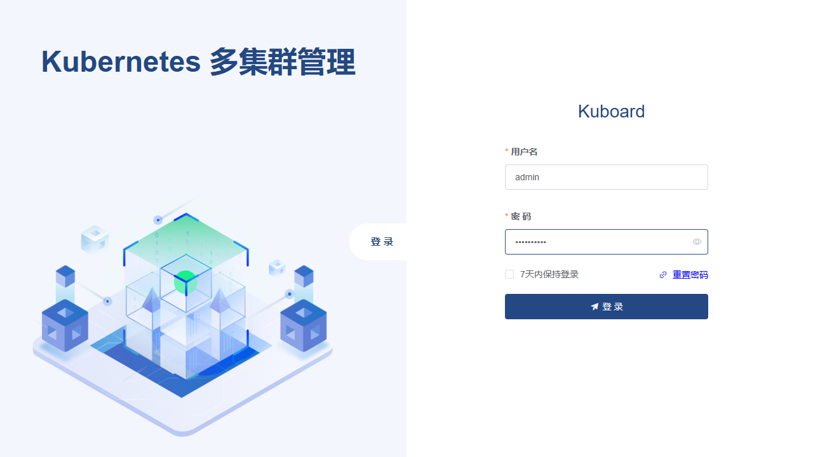

### 5.3 查看集群概览

登录后，点击 **default 集群** -> **使用 ServiceAccount kuboard-admin** -> **集群概要**，即可看到集群概览。

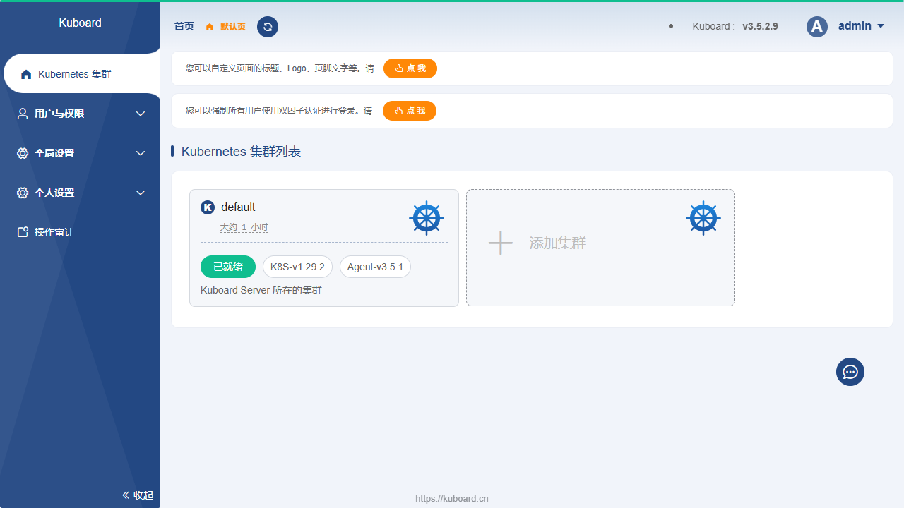

可以看到集群的 5 个节点（1 control-plane + 4 worker），以及各 namespace 中部署的资源情况。

### 5.4 查看命名空间和微服务详情

点击 **bookinfo 命名空间**，可以看到该命名空间下的所有微服务：

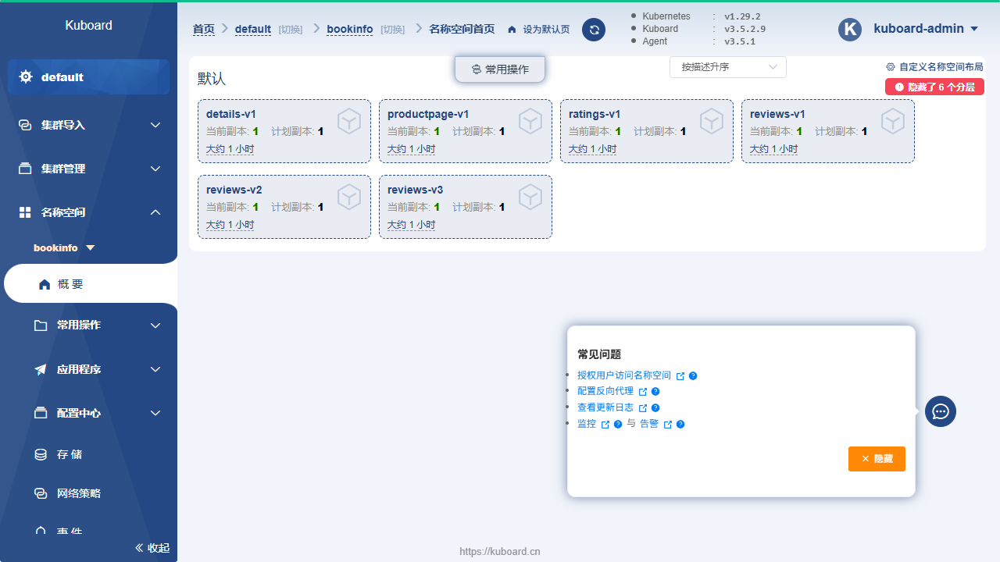

点击具体的微服务（如 details），可以查看该微服务的详细信息，包括 Pod 状态、容器日志、资源占用等。

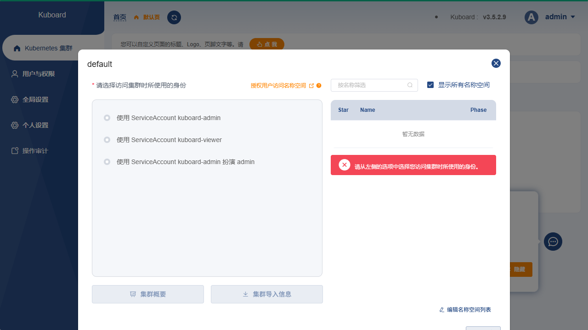

---

## 六、为 BookInfo 微服务开启 Istio 路由

### 6.1 安装 Istio

下载并安装 istioctl（v1.24.3）：

```powershell
# 将 istioctl 添加到 PATH
$env:PATH = "E:\software-service\bookinfo-lab\istioctl-bin;" + $env:PATH

# 以 demo 模式安装 istio
istioctl install --set profile=demo -y
```

验证安装：

```powershell
kubectl get pods -n istio-system
```

**执行结果：**
```
NAME                                    READY   STATUS    RESTARTS   AGE
istio-egressgateway-xxx                 1/1     Running   0          35s
istio-ingressgateway-xxx                1/1     Running   0          35s
istiod-xxx                              1/1     Running   0          51s
```

### 6.2 启用 Sidecar 注入并重启服务

为 bookinfo 命名空间启用 Istio 自动注入：

```powershell
kubectl label namespace bookinfo istio-injection=enabled
```

重启所有 deployment 以注入 Envoy sidecar：

```powershell
kubectl rollout restart deployment -n bookinfo
```

等待所有 Pod 重启完成后，每个 Pod 应显示 **READY 2/2**（包含业务容器和 Envoy sidecar）：

```powershell
kubectl get pods -n bookinfo
```

**执行结果：**
```
NAME                              READY   STATUS    RESTARTS   AGE
details-v1-xxx                    2/2     Running   0          54s
productpage-v1-xxx                2/2     Running   0          54s
ratings-v1-xxx                    2/2     Running   0          54s
reviews-v1-xxx                    2/2     Running   0          54s
reviews-v2-xxx                    2/2     Running   0          54s
reviews-v3-xxx                    2/2     Running   0          54s
```

### 6.3 配置流量路由规则

创建 `destination-rule-all.yaml`，定义各服务的 subset：

```powershell
kubectl apply -n bookinfo -f destination-rule-all.yaml
```

创建 `virtual-service-all.yaml`，配置 reviews 的流量分配（v1:20%, v2:40%, v3:40%）：

```yaml
apiVersion: networking.istio.io/v1
kind: VirtualService
metadata:
  name: reviews
spec:
  hosts:
  - reviews
  http:
  - route:
    - destination:
        host: reviews
        subset: v1
      weight: 20
    - destination:
        host: reviews
        subset: v2
      weight: 40
    - destination:
        host: reviews
        subset: v3
      weight: 40
```

应用路由规则：

```powershell
kubectl apply -n bookinfo -f virtual-service-all.yaml
```

验证规则：

```powershell
kubectl get destinationrule,virtualservice -n bookinfo
```

**执行结果：**
```
NAME                                              HOST          AGE
destinationrule.networking.istio.io/details       details       12s
destinationrule.networking.istio.io/productpage   productpage   12s
destinationrule.networking.istio.io/ratings       ratings       12s
destinationrule.networking.istio.io/reviews       reviews       12s

NAME                                             HOSTS             AGE
virtualservice.networking.istio.io/details       ["details"]       6s
virtualservice.networking.istio.io/productpage   ["productpage"]   6s
virtualservice.networking.istio.io/ratings       ["ratings"]       6s
virtualservice.networking.istio.io/reviews       ["reviews"]       6s
```

### 6.4 验证流量分配

开启端口转发并访问 http://localhost:9080/productpage ：

```powershell
kubectl port-forward svc/productpage 9080:9080 -n bookinfo
```

多次刷新页面，可以观察到三种不同的 reviews 版本：

- **v1**（无星级评分）：


- **v2**（黑色星级评分）：


- **v3**（彩色星级评分）：


流量按照 20:40:40 的比例分配到三个版本。

---

## 七、通过 Jaeger 查看系统 Trace

### 7.1 安装 Jaeger

在 Istio 仓库中 apply Jaeger 的 YAML 文件：

```powershell
kubectl apply -f ./samples/addons/jaeger.yaml
```

**执行结果：**
```
deployment.apps/jaeger created
service/tracing created
service/zipkin created
service/jaeger-collector created
```

### 7.2 配置 Istio 连接 Jaeger

创建 Istio 的追踪 provider 配置。修改 Istio 的 meshConfig，添加 Zipkin 类型的 extensionProvider：

```yaml
meshConfig:
  extensionProviders:
  - name: zipkin
    zipkin:
      service: jaeger-collector.istio-system.svc.cluster.local
      port: 9411
  defaultProviders:
    metrics: [prometheus]
    tracing: [zipkin]
  enableTracing: true
```

然后创建 Telemetry 资源启用 100% 采样率：

```yaml
apiVersion: telemetry.istio.io/v1
kind: Telemetry
metadata:
  name: mesh-default
  namespace: istio-system
spec:
  tracing:
  - providers:
    - name: zipkin
    randomSamplingPercentage: 100
```

应用配置：

```powershell
kubectl apply -f enable_tracing.yaml
```

重启 istiod 和 bookinfo 服务以使配置生效：

```powershell
kubectl rollout restart deployment istiod -n istio-system
kubectl rollout restart deployment -n bookinfo
```

### 7.3 访问 Jaeger Dashboard

开启端口转发：

```powershell
kubectl port-forward svc/tracing 16686:80 -n istio-system
```

访问 http://localhost:16686 进入 Jaeger 首页。

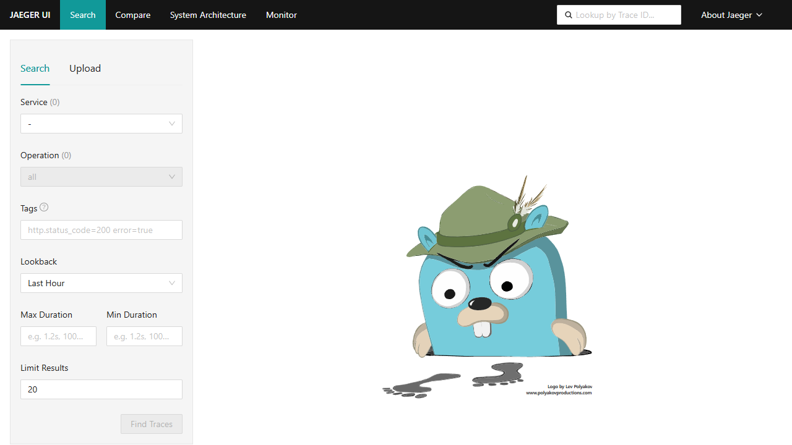

### 7.4 查看 Trace

手动刷新几次 BookInfo 的 productpage 页面后，在 Jaeger 中选择 **productpage** 服务，点击 **Find Traces**，即可看到采集到的调用链路：

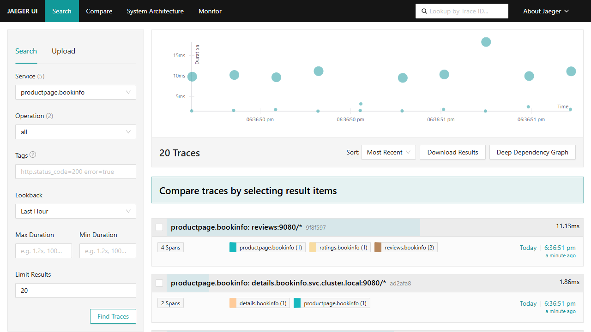

点击某条 trace，可以看到完整的调用链路瀑布图：

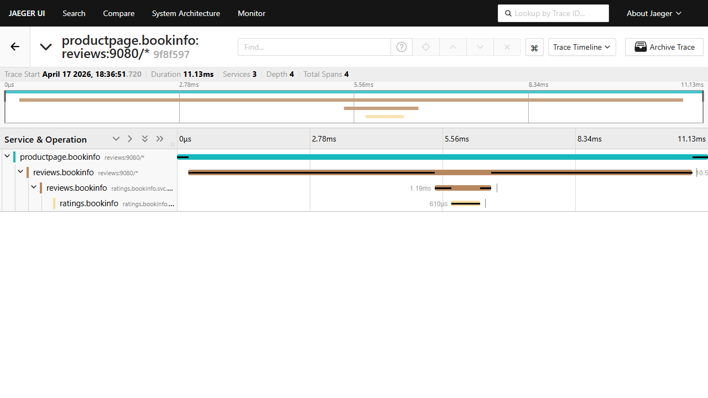

可以清楚地看到：
- `productpage` 调用了 `reviews` 服务
- `reviews` 又调用了 `ratings` 服务
- 每一跳的耗时一目了然

---

## 八、通过 Prometheus 获取系统 Metric

### 8.1 安装 Prometheus

使用 Helm 安装 kube-prometheus-stack：

```powershell
# 添加 Helm 仓库
$env:PATH = "E:\software-service\bookinfo-lab\helm-bin\windows-amd64;" + $env:PATH
helm repo add prometheus-community https://prometheus-community.github.io/helm-charts
helm repo update

# 安装 Prometheus 全家桶
helm install prometheus-operator prometheus-community/kube-prometheus-stack \
  --namespace monitoring --create-namespace
```

验证安装：

```powershell
kubectl get pods -n monitoring
```

**执行结果：** 所有 Prometheus 相关 Pod 均成功运行。

### 8.2 访问 Prometheus UI

开启端口转发：

```powershell
kubectl port-forward svc/prometheus-operator-kube-p-prometheus 9090:9090 -n monitoring
```

访问 http://localhost:9090 进入 Prometheus 首页。

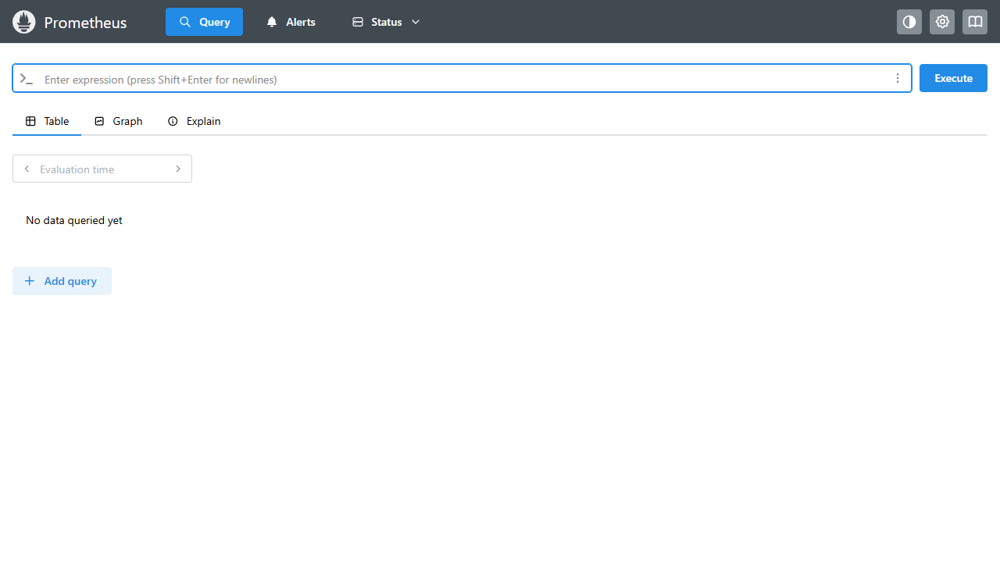

### 8.3 执行 PromQL 查询

在 Prometheus UI 中执行 `up` 查询，验证所有监控目标的健康状态：

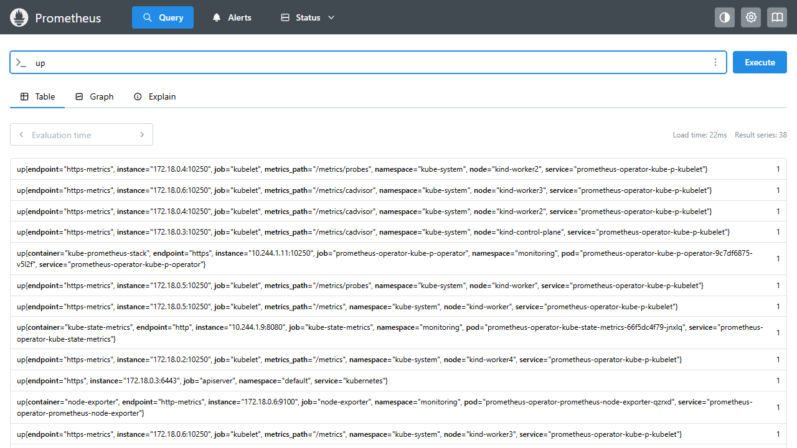

### 8.4 Python 脚本获取集群状态

使用 Python 脚本通过 Prometheus API 获取 BookInfo 各 Pod 的 CPU/内存占用和重启次数：

```python
# prometheus_monitor.py（完整代码见 prometheus_monitor.py 文件）
# 核心功能：
# - get_pod_cpu_usage(): 查询每个 Pod 的 CPU 使用量
# - get_pod_memory_usage(): 查询每个 Pod 的内存使用量
# - get_pod_restart_count(): 查询每个 Pod 的重启次数
```

运行脚本：

```powershell
python prometheus_monitor.py
```

**执行结果：**
```
=== Pod CPU Usage ===
details-v1-56c94d6f4d-ks2qx: 0.0013 cores
productpage-v1-b9d488668-nc4vd: 0.0024 cores
ratings-v1-6577f8df96-6nbrj: 0.0016 cores
reviews-v1-7fddc499f4-vkb29: 0.0029 cores
reviews-v2-8457b97568-dhq9c: 0.0025 cores
reviews-v3-5b4b8668c4-4rsn6: 0.0024 cores

=== Pod Memory Usage ===
details-v1-56c94d6f4d-ks2qx: 54.25 MiB
productpage-v1-b9d488668-nc4vd: 326.36 MiB
ratings-v1-6577f8df96-6nbrj: 81.62 MiB
reviews-v1-7fddc499f4-vkb29: 162.22 MiB
reviews-v2-8457b97568-dhq9c: 142.47 MiB
reviews-v3-5b4b8668c4-4rsn6: 156.69 MiB

=== Pod Restart Count ===
details-v1-56c94d6f4d-ks2qx: 0
productpage-v1-b9d488668-nc4vd: 0
ratings-v1-6577f8df96-6nbrj: 0
reviews-v1-7fddc499f4-vkb29: 0
reviews-v2-8457b97568-dhq9c: 0
reviews-v3-5b4b8668c4-4rsn6: 0
```

---

## 九、通过 Chaos Mesh 对微服务系统进行故障注入

### 9.1 安装 Chaos Mesh

使用 Helm 安装 Chaos Mesh：

```powershell
helm repo add chaos-mesh https://charts.chaos-mesh.org
helm repo update
helm install chaos-mesh chaos-mesh/chaos-mesh \
  --namespace chaos-mesh --create-namespace \
  --set chaosDaemon.runtime=containerd \
  --set chaosDaemon.socketPath=/run/containerd/containerd.sock \
  --version 2.7.0
```

> **注意：** kind 节点使用 containerd 运行时，必须加上 `--set chaosDaemon.runtime=containerd` 和 `--set chaosDaemon.socketPath=/run/containerd/containerd.sock`，否则 chaosDaemon 无法与容器运行时通信。

验证安装：

```powershell
kubectl get pods -n chaos-mesh
```

**执行结果：** 所有 Chaos Mesh Pod 均正常运行。

### 9.2 配置 Token 并登录

创建 RBAC 权限配置 `rbac.yaml`：

```yaml
apiVersion: v1
kind: ServiceAccount
metadata:
  namespace: default
  name: account-default-manager
---
apiVersion: rbac.authorization.k8s.io/v1
kind: ClusterRole
metadata:
  name: chaos-mesh-manager
rules:
- apiGroups: ["chaos-mesh.org"]
  resources: ["*"]
  verbs: ["get", "list", "watch", "create", "delete", "patch", "update"]
- apiGroups: [""]
  resources: ["pods", "namespaces", "nodes", "events"]
  verbs: ["get", "list", "watch"]
---
apiVersion: rbac.authorization.k8s.io/v1
kind: ClusterRoleBinding
metadata:
  name: chaos-mesh-manager-binding
subjects:
- kind: ServiceAccount
  name: account-default-manager
  namespace: default
roleRef:
  kind: ClusterRole
  name: chaos-mesh-manager
  apiGroup: rbac.authorization.k8s.io
```

应用配置并生成 token：

```powershell
kubectl apply -f rbac.yaml
kubectl create token account-default-manager -n default
```

开启端口转发并登录 Chaos Mesh Dashboard：

```powershell
kubectl port-forward -n chaos-mesh svc/chaos-dashboard 2333:2333
```

访问 http://localhost:2333 ，使用生成的 token 登录。

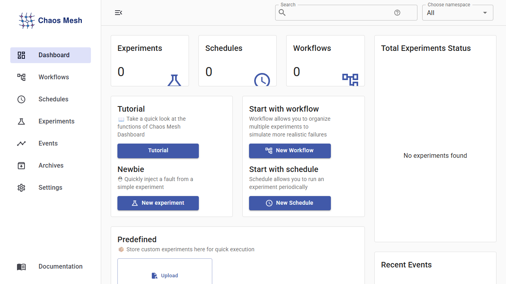

### 9.3 网络故障注入

创建 `network-partition.yaml` 切断 productpage 和 reviews 之间的通信：

```yaml
apiVersion: chaos-mesh.org/v1alpha1
kind: NetworkChaos
metadata:
  name: partition-productpage-reviews
  namespace: bookinfo
spec:
  action: partition
  mode: all
  selector:
    namespaces: [bookinfo]
    labelSelectors:
      app: productpage
  direction: both
  target:
    mode: all
    selector:
      namespaces: [bookinfo]
      labelSelectors:
        app: reviews
  duration: "5m"
```

> **注意：** 在 WSL2 环境下，由于内核缺少 `ip_set` 模块，NetworkChaos 无法直接使用。本实验使用 **Istio VirtualService 故障注入** 作为替代方案来演示网络故障效果：

```yaml
apiVersion: networking.istio.io/v1
kind: VirtualService
metadata:
  name: reviews
spec:
  hosts:
  - reviews
  http:
  - fault:
      abort:
        httpStatus: 503
        percentage:
          value: 100
    route:
    - destination:
        host: reviews
        subset: v1
```

应用故障注入后，访问 productpage，reviews 区域报错：

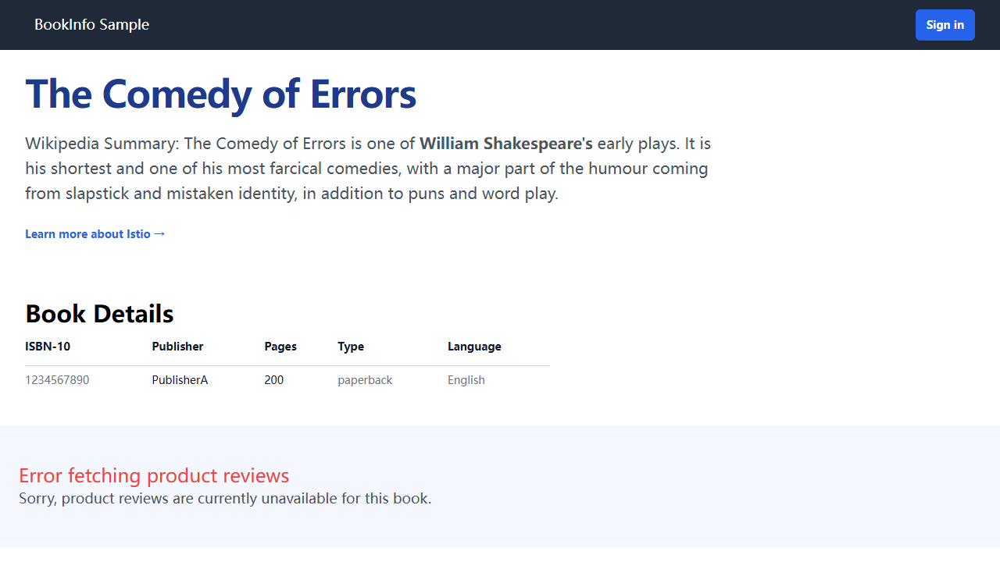

通过 Jaeger 查看 trace，可以发现错误标记：

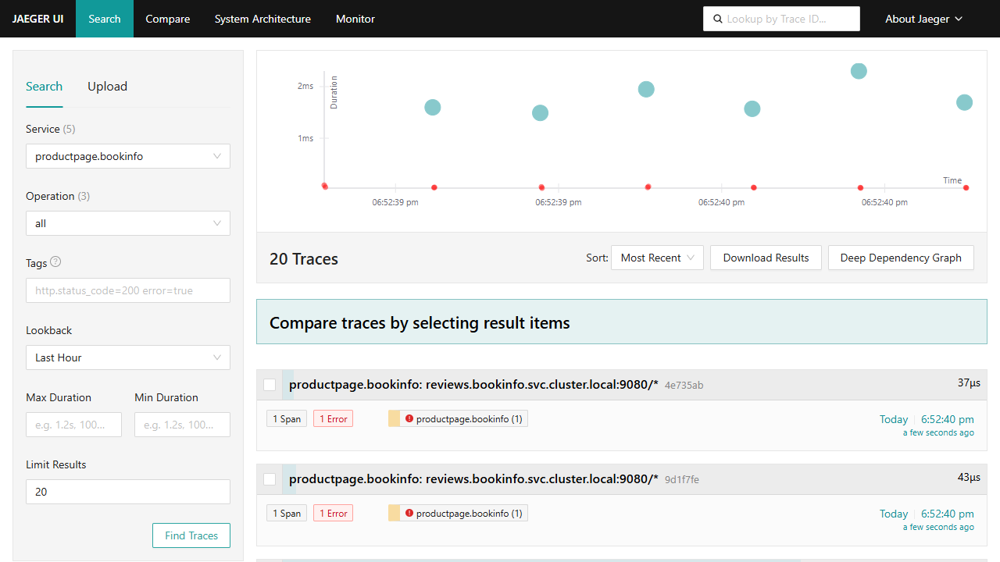

故障恢复后，删除故障注入配置并恢复原始路由规则：

```powershell
kubectl delete -f reviews-fault.yaml
kubectl apply -f virtual-service-all.yaml -n bookinfo
```

### 9.4 CPU 负载压力测试

创建 `cpu-stress.yaml` 为 productpage 注入 CPU 负载：

```yaml
apiVersion: chaos-mesh.org/v1alpha1
kind: StressChaos
metadata:
  name: cpu-stress-productpage
  namespace: bookinfo
spec:
  mode: one
  selector:
    namespaces: [bookinfo]
    labelSelectors:
      app: productpage
  stressors:
    cpu:
      workers: 4
      load: 100
  duration: "2m"
```

应用故障注入：

```powershell
kubectl apply -f cpu-stress.yaml
```

**注入前 CPU 使用情况（Python 脚本输出）：**
```
productpage-v1-b9d488668-nc4vd: 0.0035 cores
```

**注入后 CPU 使用情况：**
```
productpage-v1-b9d488668-nc4vd: 0.1994 cores  # CPU 飙升 57 倍！
```

通过 Prometheus 查询 `sum(rate(container_cpu_usage_seconds_total{namespace="bookinfo", pod=~"productpage.*"}[1m])) by (pod)` 可以看到 CPU 使用率的剧烈攀升：

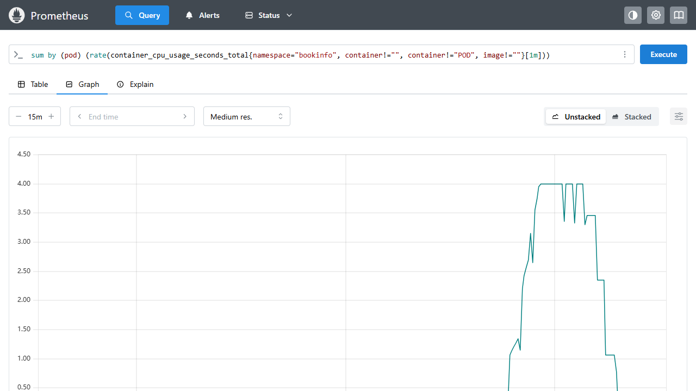

Chaos Mesh Dashboard 显示实验状态为 "Completed"：


停止故障注入后，CPU 占用率恢复正常：

```powershell
kubectl delete -f cpu-stress.yaml
```

**恢复后 CPU 使用情况：**
```
productpage-v1-b9d488668-nc4vd: 0.0024 cores  # 恢复正常
```

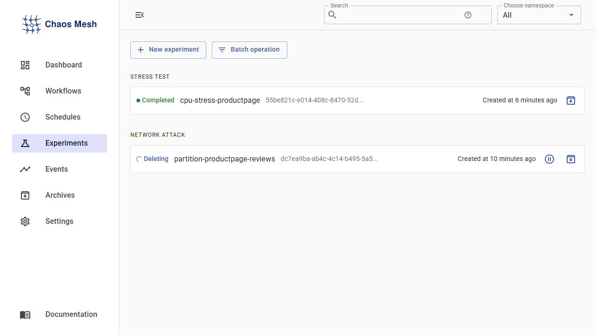

---

## 十、实验总结

### 实验一总结
通过 Docker 和 Kubernetes 成功完成了 BookInfo 微服务的 YAML 部署和源码部署。使用 kind 搭建了 5 节点集群（1 control-plane + 4 worker），验证了微服务容器化部署的完整流程。

### 实验二总结
1. **Kuboard**：成功部署并通过 Web UI 可视化管理 k8s 集群，查看命名空间、微服务部署状态、节点资源信息和容器日志。
2. **Istio 路由**：配置了 reviews 服务的流量分配规则（v1:20%, v2:40%, v3:40%），验证了灰度发布和 A/B 测试能力。
3. **Jaeger 分布式追踪**：通过 Zipkin 协议将 Envoy sidecar 的追踪数据上报到 Jaeger，成功查看了 productpage→reviews→ratings 的完整调用链路和耗时分析。
4. **Prometheus 监控**：通过 kube-prometheus-stack 收集集群指标，使用 PromQL 查询和 Python 脚本获取各 Pod 的 CPU/内存/重启次数。
5. **Chaos Mesh 混沌工程**：
   - **网络故障**：通过 Istio 故障注入模拟 productpage 与 reviews 之间的网络隔离，观察到服务降级和 Jaeger 错误追踪。
   - **CPU 压力**：通过 StressChaos 为 productpage 注入 CPU 负载，CPU 飙升 57 倍，通过 Prometheus 实时监控到指标变化，故障移除后系统自动恢复。

### 关键技术发现
- Istio 1.24 的追踪配置需要使用 `extensionProviders` + `Telemetry` 资源（而非旧版 `meshConfig.defaultConfig.tracing`）
- WSL2 内核不包含 `ip_set` 模块，导致 Chaos Mesh 的 NetworkChaos 无法使用，可用 Istio VirtualService 故障注入替代
- 端口转发时需注意代理设置，避免 localhost 请求被转发到代理服务器

---

## 附录：常用命令

```powershell
# 查看所有 namespace 中的 pod
kubectl get pods --all-namespaces

# 查看 pod 日志
kubectl logs <pod-name> -n bookinfo

# 端口转发
kubectl port-forward svc/productpage 9080:9080 -n bookinfo          # BookInfo
kubectl port-forward -n kuboard svc/kuboard-v3 30080:80              # Kuboard
kubectl port-forward svc/tracing 16686:80 -n istio-system            # Jaeger
kubectl port-forward svc/prometheus-operator-kube-p-prometheus 9090:9090 -n monitoring  # Prometheus
kubectl port-forward -n chaos-mesh svc/chaos-dashboard 2333:2333     # Chaos Mesh

# 删除 namespace（清理资源）
kubectl delete namespace bookinfo
kubectl delete namespace bookinfo-src

# 删除 kind 集群
kind delete cluster --name bookinfo-cluster
```
